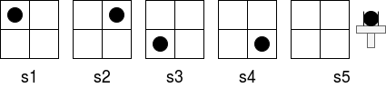
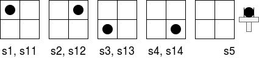

# MDP Abstraction #

This repository contains algorithms for minimizing Markove Decision Processes (MDP)
given a fully-specified deterministic MDP as an input. The minimal MDP and the original
MDP can be equivalent either under the notion of **bisimulation** or **MDP homomorphism**.

## Environments ##

Two example environments are included.

### Pick ###



A simple environment with 5 states and 4 actions. The goal is to pick the puck in the
2x2 grid. The states are illustrated above and the actions are simply PICK for each
of the 4 possible positions in the grid. If the PICK action is executed in the coordinate
where the puck is, the environment transitions into state 5 and reward 1 is award. Otherwise,
the environment stays in the same state and the reward is 0.

### Redundant Pick ###

This environment is the same as the Pick environment except there are 4 redundant states 11, 12, 13, and 14 
that behave in the same way as states 1, 2, 3 and 4.



## Minimization ##

### Bisimulation ###

Bisimulation [(Givan 2012)](https://www.sciencedirect.com/science/article/pii/S0004370202003764) considers two states 
to be equal if they, roughly speaking, behave the same given an arbitrary action.

**Pick:**

Bisimulation partitions each state separately, the Pick environment is already minimal.

state partition = {{1}, {2}, {3}, {4}, {5}}

**Redundant Pick:**

Bisimulation does not offer much help with abstracting states, but it can find redundant states:

state partition = {{1, 11}, {2, 12}, {3, 13}, {4, 14}, {5}}


### Homomorphism

MDP homomorphism [(Ravindran 2014)](https://dl.acm.org/citation.cfm?id=1023021) is more lenient than bisimulation
because two states can be equivalent even if they do not behave the same given some action.

**Pick:**

Homomorphism partitions the state space in a more useful way:

state partition = {{1, 2, 3, 4}, {5}}

**Redundant Pick:**

state partition: {{1, 2, 3, 4, 11, 12, 13, 14}, {5}}

## Setup ##
 
Install Python 3.

## Usage ##

```
python -m scripts.pick_bisimulation
...
```
